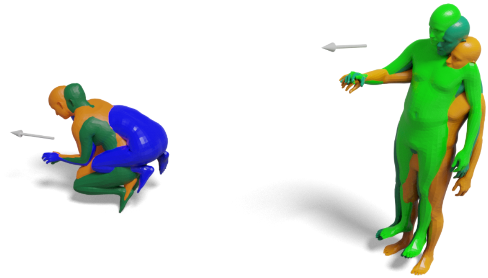

# CReach
This repository is the official implementation of the CReach model from 
our __3DV 2025__ paper:

**3D Whole-body Grasp Synthesis with Directional Controllability**
(https://gpaschalidis.github.io/cwgrasp/).

<a href="">

</a>

<p align="justify">
CReach is a generative model for reaching body generation, conditioned on a given arm direction and the desired wrist location of 
either the right or the left hand. 
</p>

## Installation & Dependencies
Clone the repository using:

```bash
git clone git@github.com:gpaschalidis/CReach.git
cd creach
```
Run the following commands:
```bash
conda create -n creach python=3.9 -y
conda activate creach
conda install pytorch=2.0.1 torchvision torchaudio pytorch-cuda=11.7 -c pytorch -c nvidia
```
```bash
pip install -r requirements.txt
 ```
## Getting started

If you want to retrain CReach from scratch, you must first build the dataset we use.

<p align="justify" style="word-wrap: break-word;">
We have trained CReach using both the GRAB and CIRCLE datasets. Since both datasets belong to other institutions, 
we cannot provide the final dataset directly. Instead, we provide scripts that you can use to build it yourself.
</p>

- Download the GRAB dataset from the [GRAB website](https://grab.is.tue.mpg.de), and follow the instructions to extract the files.

- Downoad the CIRCLE dataset from [here](https://circledataset.s3.us-west-2.amazonaws.com/release/CIRCLE_movement.zip) and unzip the file.

Put both datasets in the the folder "datasets", following the structure below:

```bash
    datasets
    ├── GRAB
    │    └──  grab
    │          └── s1    
    │          └── ...    
    │          └── s10    
    │            
    └── CIRCLE_movement
         └── s1  
         └── ... 
         └── s7_left 
```

#### SMPLX models
- Download body models following the steps on the [SMPLX repo](https://github.com/vchoutas/smplx) and put it in the folder "models"
- Run the following commands to merge GRAB and CIRCLE into a single dataset.

```bash
 cd creach
 python process_creach_dataset/process_grab_circle_data.py --grab_path datasets/GRAB/grab/ --circle_path datasets/CIRCLE_movement --save_path datasets/grab_circle_dataset --smplx_path models/

```

<p align="justify" style="word-wrap: break-word;">
To annotate the dataset with left and right arm reaching bodies while ensuring an equal number of each, we use the following two scripts.
The first script detects left arm reaching bodies and transforms them into right arm reaching bodies, creating a 
dataset that consists only of right arm reaching bodies.
</p>

```bash
 python prepare_creach_dataset/process_body_data.py --dataset_path datasets/grab_circle_dataset --smplx_path models/ --save_dir datasets/grab_circle_only_rh
```

<p align="justify" style="word-wrap: break-word;">
Finally, we use the following script to first mirror the previous dataset and them merge them together. By merging these two 
datasets we obtain the final dataset, used to train CReach.
</p>

```bash
 python prepare_creach_dataset/mirror_body_data.py --dataset_path datasets/grab_circle_only_rh --smplx_path models/ --save_dir datasets/creach_dataset
```

## Train CReach
Now to train CReach from scratch use the following command:

```bash
python train/train_creach.py --work-dir $working_directory  --grab-circle-path datasets/creach_dataset --smplx-path models/
```

## Test CReach
To try CReach you need as inputs an arm direction and a wrist location. 

- Download first the GRAB object mesh (`.ply`) files from the [GRAB website](https://grab.is.tue.mpg.de/).

- Download the ReplicaGrasp dataset from [FLEX github page](https://github.com/purvaten/FLEX).

Put both of them in the folder "reaching_data" so you have the following structure.

```bash
      reaching_data
       │  
       ├── contact_meshes
       │    ├── airplane.ply
       │    └── ...
       │
       └── replicagrasp
            ├── dset_info.npz
            └── receptacles.npz
```
 - You can download our pre-trained model from [here](https://docs.google.com/forms/d/1TBkvFmiLwf_TAnZOlBEmEXck1Tv-MNUcftlOKxKow1Q/edit) and place it in the folder "pretrained". 
   The folder "pretrained" should have the following structure:

```bash
    pretrained
      └── creach.pt
```   

Using the following command you can generate and visualize reaching bodies using our CReach model. You can specify the number of samples to generate, the gender of the samples and the arm type (right or left).
```bash
python generate_reaching_bodies.py --obj_rec_conf apple_receptacle_aabb_bottomfrl_apartment_refrigerator_up_1 --save_path $SAVE_FOLDER --smplx_path models/ --gender "FEmale" --grasp_type "left" --num_samples 5 --vis
```
You can find more configurations inside the file "dset_info.npz".


## Citation
If you found this work influential or helpful for your research, please cite:
```
@inproceedings{paschalidis2025cwgrasp,
  title     = {{3D} {W}hole-Body Grasp Synthesis with Directional Controllability},
  author    = {Paschalidis, Georgios and Wilschut, Romana and Anti\'{c}, Dimitrije and Taheri, Omid and Tzionas, Dimitrios},
  booktitle = {{International Conference on 3D Vision (3DV)}},
  year      = {2025}
 }
```
